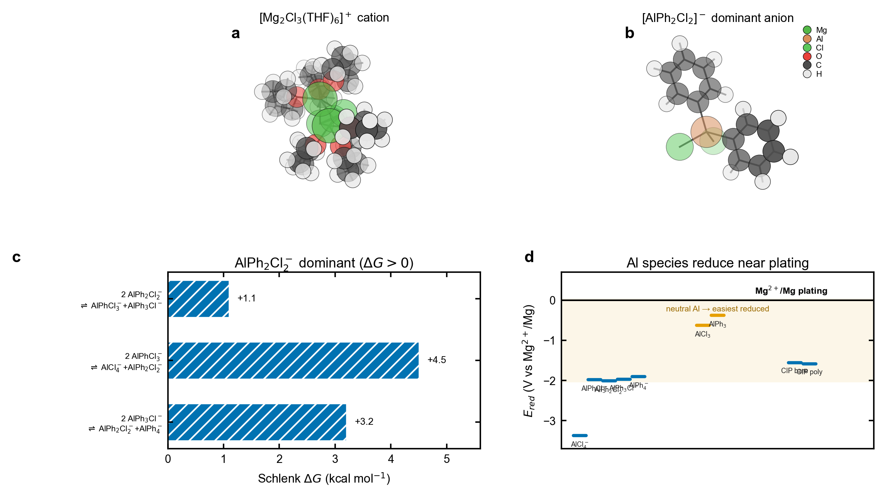
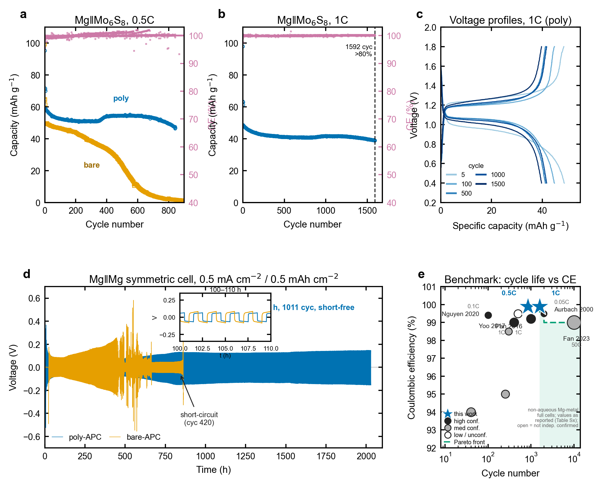
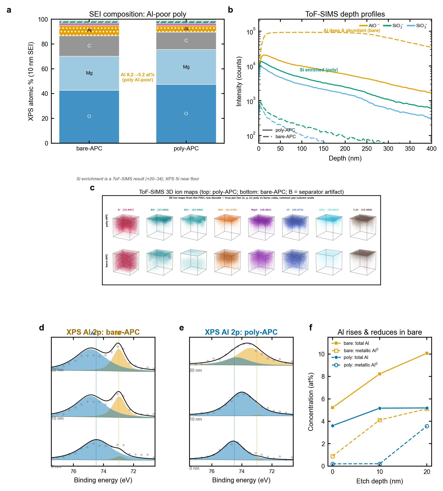
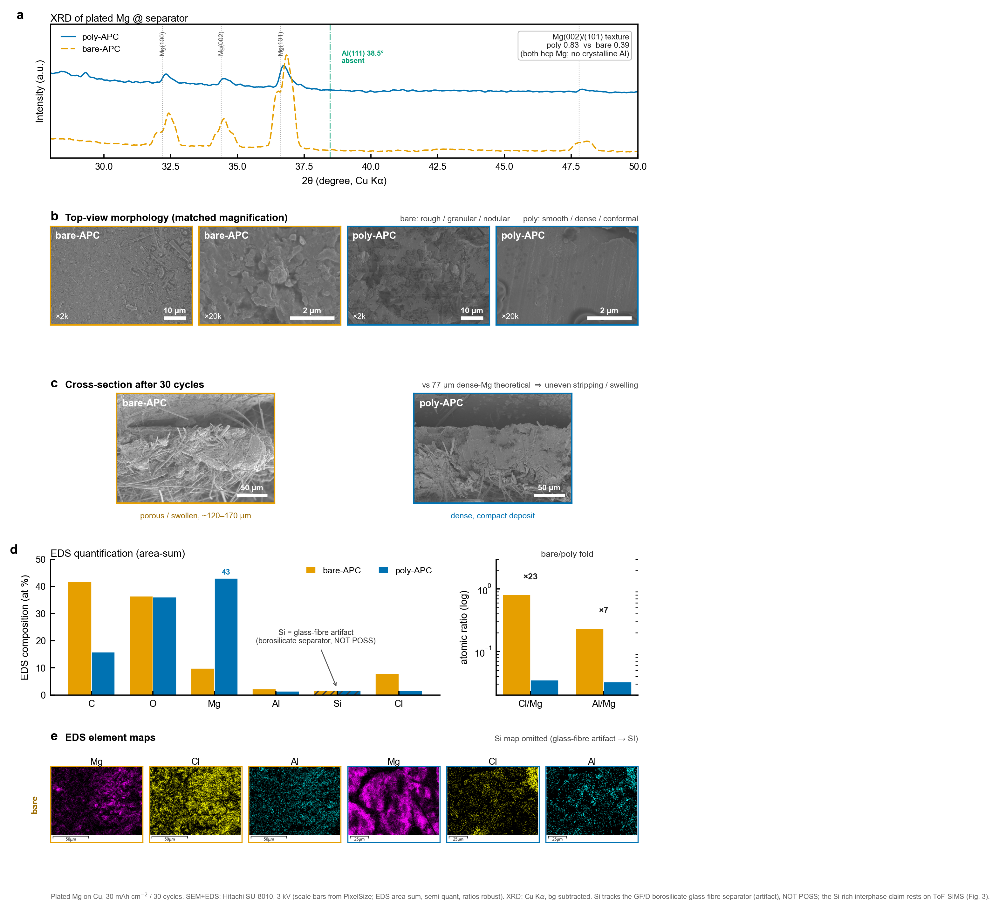
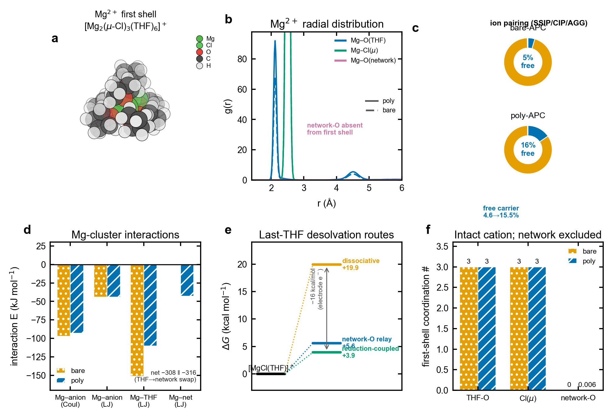
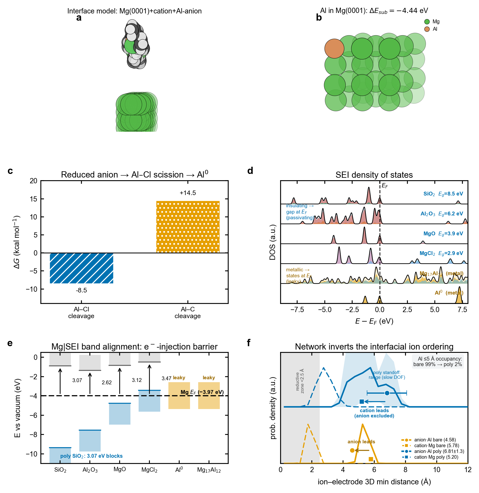
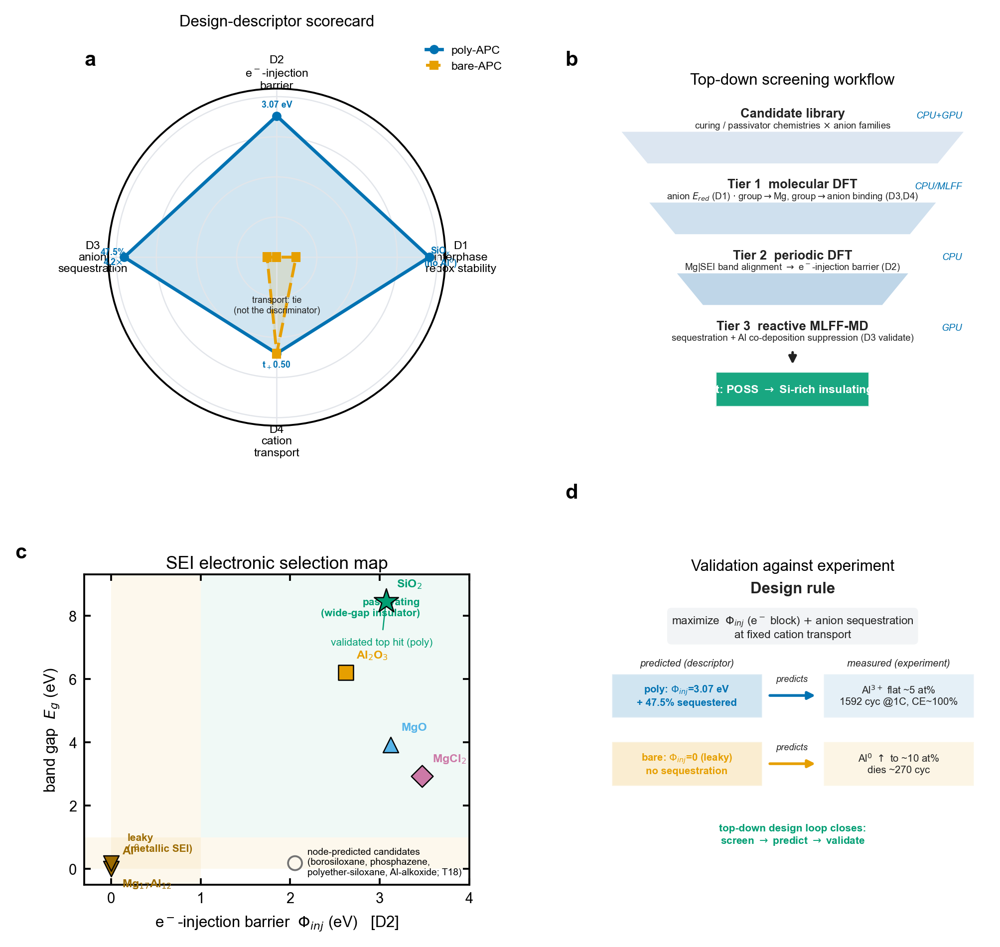

# A Silicon-Rich, Aluminum-Poor Interphase Templated by an In Situ Silsesquioxane Network Enables Reversible Magnesium Metal Anodes

*Author One,1 Author Two,1 and Corresponding Author1,**
*[1] Department of Chemistry, Institution, Address. E-mail: corresponding@institution.edu*

**Abstract.** Magnesium metal anodes promise high volumetric capacity and dendrite resistance, but their reversibility in the benchmark all-phenyl complex (APC) electrolyte remains limited, and the molecular origin has stayed ambiguous. Here we show that polymerizing APC in situ with a polyhedral oligomeric silsesquioxane (POSS) network does not change how fast Mg2+ moves—the transference number and chemical diffusivity are unchanged, and molecular dynamics finds transport in the gel is if anything slower—but instead re-programs what the anode interphase is made of. Depth-resolved time-of-flight secondary-ion mass spectrometry and X-ray photoelectron spectroscopy reveal that the liquid builds a thick, aluminum-rich interphase containing reduced metallic Al0 co-deposited to ~350 nm, whereas the network confines a thin (~90 nm), silicon-rich, aluminum-poor layer in which aluminum survives only as oxidized Al3+. First-principles calculations identify the reducible APC aluminate anion as the co-deposition source and show that the cured network excludes it both by sequestration and by an electronically insulating, silicon-rich passivating layer. This compositional switch—silicon in, aluminum out—sustains stable Mg||Mo6S8 full-cell cycling and short-free symmetric plating where the liquid fades and shorts, establishing interphase composition, not ion transport, as the design lever for reversible magnesium anodes.

## Introduction

Rechargeable magnesium batteries are an attractive complement to lithium technology. Magnesium is abundant and low-cost, it provides a high volumetric capacity of 3833 mAh cm-3 by virtue of its divalent, dense metal, and it was long thought to electrodeposit smoothly rather than as dendrites.[1,2] These features made the Mg metal anode a long-standing target for safe, high-energy storage, and they continue to motivate the broader search for multivalent battery chemistries.[3,4,5] In practice, however, a reversible Mg metal anode has proven difficult to realize. Magnesium passivates readily in most polar aprotic solvents, forming blocking surface films that stop interfacial Mg2+ transfer, so that only a narrow set of specially designed electrolytes supports reversible plating and stripping.[6,7]

Among these, the all-phenyl complex (APC), formed from AlCl3 and PhMgCl in tetrahydrofuran (THF), remains the most widely used benchmark, because it combines a usable anodic window above 3 V with reasonable plating reversibility.[8] Yet even in APC the magnesium anode falls short of the durability a practical cell requires, and the reasons have remained surprisingly unclear.[9] Much of the field’s effort has gone toward widening the anodic window or improving cathodes, while the negative-electrode interphase—the layer that actually governs whether plating is clean and reversible—has been comparatively underexplored for magnesium. This is in sharp contrast to lithium, where the solid electrolyte interphase (SEI) has been studied intensively since it was first conceptualized.[10,11]

Recent work has clarified the morphological side of magnesium-anode failure and supplies the framework on which the present study builds. In APC, magnesium plating is dense and uniform across a wide range of current densities; the unheeded failure mode is instead an uneven, self-accelerating stripping that pits the anode and is governed by the local transport and accumulation of the chlorine-containing complex ions at the interface.[12] Plating uniformity, in turn, follows the competition between ion diffusion and crystal nucleation, with the strong association of the chloro-bridged cation and the chloroaluminate anion holding the system in a kinetically controlled, dendrite-free regime.[13] In this account the controlling variables are interfacial ion transport and morphology, and the interphase is treated as compositionally secondary. What it leaves open is the chemistry of the very anion it places at the interface.

Those charge-carrying species are not innocent. Structural analyses establish that the cation is the chloro-bridged dimer [Mg2(μ-Cl)3(THF)6]+, while the anion is a family of chloro-organo-aluminates, [AlPhxCl4-x]-.[14] This aluminate anion is electroactive. Prior work treated it almost exclusively as an oxidation liability that sets the anodic limit, and the magnesium-anode literature, reasoning by analogy with lithium, has framed the cathodic interphase mainly in terms of inorganic salts.[4,9] The complementary possibility—that the aluminate anion is itself reduced at the negative electrode and co-deposits aluminum into the growing interphase—has not been examined, even though such co-deposition would directly compromise the purity and reversibility of the magnesium deposit. It would also help rationalize why magnesium, once assumed dendrite-free, is now known to grow rough and even dendritic under sustained plating.[15,16]

Interphase engineering has transformed lithium batteries and is beginning to do the same for magnesium. Artificial coatings and electrolyte additives that build a favorable interphase can convert an otherwise passivating Mg electrolyte into a reversible one, showing that the interphase, and not only the bulk electrolyte, sets magnesium reversibility.[9,17] What has been missing is a molecular account of the native APC interphase: what it is made of, how it forms, and which electrolyte species control its composition. Obtaining that account requires resolving the interphase by both depth and chemical state and then connecting its composition to the underlying solution chemistry, which is the combination of experiment and theory we apply here.

The conventional lever for improving a metal-anode electrolyte is to modify ion transport, for example by gelation or by adding coordinating polymers assumed to accelerate cation motion.[2,18] A parallel strategy has been to redesign the salt itself, for instance with non-nucleophilic or halogen-free anions that widen the window or improve compatibility with sulfur cathodes, or with fully inorganic chloroaluminate complexes whose reversibility is set by electrolytic conditioning.[19,20,21] Both strategies treat the electrolyte bulk. We instead ask a compositional, interfacial question: can a cured, chemically inert network change what the magnesium interphase is made of, rather than how fast ions move through it, and thereby emulate the protective role played by an engineered artificial interphase?[17] Silsesquioxane (POSS) cages are well suited to this purpose because they are rigid, electrochemically robust, and silicon-rich, and have been used to build mechanically stable polymer electrolytes.[22]

Here we show that curing APC in situ with an octa-functional POSS network re-programs the magnesium-anode interphase from aluminum-rich to silicon-rich, and that this compositional switch—not any change in transport—is what makes plating reversible. Combining full-cell and symmetric-cell cycling, corrosion and impedance analysis, depth-resolved time-of-flight secondary-ion mass spectrometry (ToF-SIMS) and X-ray photoelectron spectroscopy (XPS), and density functional theory (DFT) with classical and ab initio molecular dynamics (MD), we locate the difference at the interphase. The liquid electrolyte (bare-APC) co-deposits metallic Al0 into a thick interphase, whereas the cured electrolyte (poly-APC) confines a thin, silicon-rich, aluminum-poor layer in which aluminum remains oxidized. The calculations identify the reducible aluminate anion as the source of the co-deposited aluminum and show that the network excludes it both by sequestering it from the plating front and by interposing an electronically insulating, silicon-rich passivating layer. Throughout, we report bare-APC and poly-APC in parallel, and we show by three independent measures that bulk Mg2+ transport is not the discriminator. The result reframes magnesium-anode electrolyte design as a problem of interphase composition.

## Results and Discussion

### Electrolyte Design and Aluminate Speciation

poly-APC is prepared by curing an octa-functional POSS monomer inside liquid APC, which converts the free-flowing electrolyte into a self-standing gel without altering the underlying salt chemistry (Figure 1a; full preparation and all experimental procedures are given in the Supporting Information). The two electrodes compared throughout are magnesium cycled in liquid APC (bare-APC) and magnesium cycled in the cured gel (poly-APC). Because the salt is unchanged, any difference in behavior must originate in how the network reorganizes the electrolyte and the interphase rather than in a new active species.

To define the electroactive species, we mapped the APC anion distribution by DFT in implicit THF (B3LYP-D3(BJ)/def2-TZVP with the SMD continuum model; full computational details and references are in the Supporting Information),[23,24,25,26,27] starting from the cation and anion families established spectroscopically and crystallographically for APC.[14] The cation remains the intact chloro-bridged dimer [Mg2(μ-Cl)3(THF)6]+ (Figure 1a). For the anions, every Schlenk-type phenyl/chloride redistribution equilibrium is uphill in free energy (ΔG = +1.1 to +4.5 kcal mol-1), so the symmetric chloro-organo-aluminate [AlPh2Cl2]- dominates the population, with the fully chlorinated AlCl4- a minority species (Figure 1b). This computed speciation agrees with the species identified by Raman, multinuclear NMR, and single-crystal diffraction for APC-type solutions, and with conditioning studies of the related magnesium aluminum chloride complex in which speciation governs reversibility.[8,14,28]

Placing each species on a common potential scale referenced to Mg2+/Mg reveals why this anion matters at the negative electrode (Figure 1c). The chloro-organo-aluminate anions are reduced between -1.9 and -2.0 V, AlCl4- near -3.4 V, and the neutral aluminum species and contact ion pairs sit closest to the plating potential, between -0.4 and -1.6 V. In other words, aluminum reduction is thermodynamically accessible within, or just beyond, the window in which Mg2+ plates. The redox ladder thus identifies a concrete pathway for aluminum reduction during plating that has no counterpart in the cation chemistry. This reframes the aluminate anion, previously discussed mainly as an anodic-limit liability,[4] as a cathodic actor, and motivates the interphase analysis that follows.

This finding also revises how the APC anion should be viewed. In the prior literature the aluminate anion was discussed almost entirely through its oxidation, because its highest occupied orbital sets the anodic limit of the electrolyte.[4,8] The reduction side received little attention, presumably because aluminum reduction was assumed irrelevant next to magnesium plating. The redox ladder shows the opposite: the same anion that limits the anodic window is also reducible near the cathodic working potential, so a single species governs stability at both electrodes. For the magnesium anode it is the cathodic role that matters, and it is this role that the cured network is designed to suppress.

*Figure 1. Electrolyte design and aluminate redox landscape. (a) [Mg2(μ-Cl)3(THF)6]+ cation and dominant [AlPh2Cl2]- anion (DFT). (b) Schlenk redistribution free energies (all >0, so [AlPh2Cl2]- dominates). (c) Reduction potentials of APC species versus Mg2+/Mg; the aluminate anions and neutral aluminum species are reducible within or near the plating window.*

### Reversible Magnesium Plating without a Transport Advantage

poly-APC outperforms bare-APC in every test that stresses interfacial stability over time. In Mg||Mo6S8 (Chevrel phase) full cells, the configuration used to demonstrate the first prototype Mg battery and refined in later Chevrel cathodes,[1,29] poly-APC retained more than 80% of its reversible capacity over the entire 842-cycle run at 0.5C and for ~1592 cycles at 1C, with a per-cycle Coulombic efficiency (CE) close to 100% (Figure 2a,b). bare-APC, by contrast, fell below 80% retention by ~270 cycles and decayed to near-zero capacity within ~700 cycles. Galvanostatic charge–discharge profiles for poly-APC overlapped from cycle 5 to 1500 with minimal polarization growth (Figure 2c), the signature of a stable rather than a continuously reconstructing interphase. Benchmarked against the published literature on non-aqueous Mg-metal full cells, this performance places poly-APC on the cycle-life versus Coulombic-efficiency Pareto front (Figure 2e): it provides the highest Coulombic efficiency among Mg full cells that exceed roughly 1500 cycles, and it does so at a practical 1C rate, whereas the few reports of still-longer cycle life rely either on ultrahigh rates or on non-magnesium-metal chemistries.[1]

Symmetric Mg||Mg cells told the same story over long times (Figure 2d). poly-APC plated and stripped for 1011 cycles (2022 h) with no short-circuit events and a flat polarization, whereas bare-APC developed soft shorts from cycle 262 and failed by a hard short at cycle 420 (839 h), a 2.4-fold shorter lifetime. This contrast is consistent with the modern recognition that magnesium, contrary to early assumptions, can grow rough and dendritic under sustained plating.[15,16] Potentiodynamic (Tafel) polarization reinforced the picture: poly-APC showed a lower corrosion current density (0.107 versus 0.185 mA cm-2) and a higher, stable polarization resistance (2873 versus 689 Ω cm2), while the bare-APC cathodic branch ran away on repeated sweeps (Supporting Information). In situ impedance analysis added that the poly-APC interphase, though more resistive, was far more stable over cycling (relative variation 3.5% versus 22%), pointing to a self-limiting passivation rather than a transport penalty, in the spirit of the protective artificial interphases that enable Mg cycling in otherwise passivating electrolytes.[17]

Crucially, this advantage is not a transport advantage. Three independent measures agree that bulk Mg2+ transport is the same in both electrolytes, or slower in the gel. The Mg2+ transference number is 0.50 in both by MD and is equal and near zero in both by the Bruce–Vincent method (0.003 versus 0.005), the small absolute value being the limiting-current fraction expected for strongly associated electrolytes with large passivating interfaces;[30] MD further finds the gel ~4.4-fold slower in Mg2+ self-diffusion (Supporting Information). Gelation therefore does not raise the Mg2+ current fraction; it only adds stable interfacial impedance. For completeness, on an inert copper substrate in short plating–stripping tests bare-APC matched or slightly exceeded poly-APC in apparent CE, but such short plating–stripping tests are known to overstate reversibility and those cells fail by soft-shorting;[31] the reversibility difference emerges only under the sustained full-cell and symmetric-cell conditions above. This parity is expected rather than surprising. In APC the strong cation-anion association already secures a kinetically controlled, dendrite-free plating regime, so bulk transport is not a lever the cured network can pull, and the measurements confirm that it does not.[13] Having ruled out transport, we now ask what the two interphases are made of.

These electrochemical signatures form a coherent set. The lower, stable corrosion current of poly-APC—a 1.7-fold smaller corrosion current and a 4.2-fold larger polarization resistance—implies a slower parasitic reaction at open circuit, consistent with the higher capacity retention. The bare-APC cathodic branch, by contrast, grew on successive sweeps rather than stabilizing, the fingerprint of an interface that continually reconstructs as fresh metallic aluminum is exposed.[15] None of these differences tracks a transport parameter; all of them track interfacial stability, which is the property the cured network is found to control.

*Figure 2. Reversible plating without a transport advantage (bare-APC versus poly-APC). (a,b) Mg||Mo6S8 discharge capacity and Coulombic efficiency per cycle at 0.5C and 1C. (c) poly-APC charge–discharge voltage profiles at selected cycles. (d) Mg||Mg symmetric-cell voltage versus time. (e) Cycle-life versus Coulombic-efficiency benchmark of non-aqueous Mg-metal full cells from the literature (values as reported; tabulated with sources and confidence in the Supporting Information; open symbols are reports not independently confirmed here): poly-APC lies on the cycle-life/efficiency Pareto front, with the highest Coulombic efficiency among Mg full cells that exceed about 1500 cycles, at a practical 1C rate.*

### A Silicon-Rich, Aluminum-Poor Interphase

Depth-resolved ToF-SIMS of cycled magnesium anodes shows that the two interphases differ sharply in composition (Figure 3). Silicon secondary ions were enriched 20- to 34-fold in poly-APC relative to bare-APC (Si-, SiO2-, SiO3-), identifying the cured POSS network as a silicon-rich surface layer, while every aluminum-bearing ion was depleted in poly-APC by factors of 0.02 to 0.5 (Figure 3a). The depth profiles separate the interphases further: aluminum oxide ions persisted to ~350 nm in bare-APC but were confined to ~90 nm in poly-APC, and the silicon ions in poly-APC were likewise surface-localized (Figure 3b). Three-dimensional ion reconstructions confirm an aluminum-rich, deep interphase in bare-APC and a thin, silicon-rich skin in poly-APC (Figure 3c). Because borosilicate-separator background contributes to the silicon and boron signals, only the large poly-APC excess above this baseline is assigned to the POSS layer.

XPS depth profiling resolved the chemical state of this aluminum and provides the decisive mechanistic evidence (Figure 3d–f). In bare-APC the Al 2p signal sat at ~73.0 eV, the position of metallic and alloyed Al0, and the aluminum concentration rose with depth from 5 to 10 at%, with roughly half of the buried aluminum in the metallic state (Figure 3d,f). In poly-APC the Al 2p signal sat at 74.0 eV, the position of oxidized Al3+, and stayed low and flat at ~5 at% (Figure 3e,f). The reduced-versus-oxidized split of ~1 eV is therefore the direct spectroscopic image of aluminum co-deposition in bare-APC and its suppression in poly-APC. This assignment reproduces the oxidized Al3+ position measured for poly-APC and places bare-APC at the standard Al0/dilute Mg–Al position, with the depth-resolved growth of the metallic component as the primary co-deposition signature. A full multi-element comparison (Al 2p, Si 2p, Cl 2p, Mg 1s, O 1s, C 1s) at all three etch depths is consistent with this picture (Supporting Information). That bare-APC builds an aluminum-rich, partly metallic interphase while poly-APC keeps aluminum oxidized and dilute is exactly the kind of interphase-composition difference long invoked, but rarely resolved, to explain magnesium reversibility.[9,17]

Raman spectroscopy independently confirmed both halves of the story: the POSS Si–O–Si network modes appeared only in poly-APC, and the aluminate anion shifted toward its free, de-paired form with a 34% smaller Al–Cl envelope (Supporting Information). We emphasize that the magnitude of the silicon enrichment is a ToF-SIMS result. In XPS the silicon signal is near the detection floor, and in energy-dispersive X-ray spectroscopy the silicon signal localizes onto the glass-fiber separator and is an artifact rather than a measure of the POSS layer (see below). Taken together, the spectroscopy establishes the central compositional fact of this work: bare-APC builds a thick, aluminum-rich interphase that contains reduced metallic aluminum, whereas poly-APC builds a thin, silicon-rich layer in which aluminum survives only as an oxidized, surface-confined residue.

Two features of the XPS data deserve emphasis. First, the metallic Al0 component in bare-APC is not a surface contaminant but grows with sputter depth, reaching roughly half of the Al 2p intensity in the subsurface, so co-deposited aluminum is built into the interphase rather than adsorbed on top of it. Second, the depth over which aluminum accumulates in bare-APC matches the ~350 nm aluminum-ion penetration measured independently by ToF-SIMS, so the two techniques agree on both the chemical state and the spatial extent of the buried aluminum. Both the oxidized Al3+ position for poly-APC and the metallic Al0/dilute-alloy position for bare-APC are standard assignments, and the ~1 eV separation we report is conservative, so the reduced-versus-oxidized distinction does not rest on a fine calibration.

*Figure 3. A silicon-rich, aluminum-poor interphase. (a) ToF-SIMS poly/bare intensity ratios. (b) ToF-SIMS depth profiles. (c) Three-dimensional ion maps (top, poly-APC; bottom, bare-APC). (d,e) XPS Al 2p at 0/10/20 nm for bare-APC and poly-APC (raw data, Shirley background, fitted Al0 and Al3+ components). (f) Aluminum and metallic-Al0 content versus depth.*

### From Interphase Composition to Deposit Morphology

The compositional switch propagates to the magnesium deposit itself (Figure 4). X-ray diffraction showed metallic hexagonal magnesium in both cases, with no crystalline aluminum or Mg–Al phase, but the poly-APC deposit was about twice as textured (A002/A101 = 0.83 versus 0.39), indicating a more oriented, conformal layer rather than the randomly oriented, protruding grains formed in bare-APC (Figure 4a). The absence of a crystalline aluminum phase is consistent with the co-deposited aluminum being amorphous or alloy-dilute, exactly the form detected by XPS and ToF-SIMS rather than by bulk diffraction, and it shows that the texture difference reflects how magnesium nucleates and grows rather than a second bulk phase.

Scanning electron microscopy showed dense, consolidated magnesium grains for poly-APC and a finer, more porous particulate for bare-APC (Figure 4b); the latter morphology is the one generally associated with low plating efficiency and short-circuit risk.[15] The contrast was starker in cross-section after extended cycling: the bare-APC deposit was porous and swollen, roughly twice the thickness expected for dense magnesium, whereas the poly-APC deposit stayed compact (Figure 4c). This is the morphological fingerprint of the uneven, self-accelerating stripping that limits liquid-APC anodes, and it is the failure mode the cured network suppresses.[12] Energy-dispersive X-ray spectroscopy (EDS) of the deposits corroborated the interphase chemistry at micrometer depth: relative to magnesium, bare-APC contained roughly 7-fold more aluminum and 23-fold more chloride, and substantially more oxygen and carbon, whereas the poly-APC deposit was magnesium-dense and clean (Figure 4d). These ratios are robust because they are internal to each spectrum and therefore independent of surface coverage.

One control deserves explicit statement. In EDS the silicon signal maps onto the glass-fiber (borosilicate) separator filaments rather than the deposit, so EDS cannot test the POSS hypothesis and indeed shows no silicon enrichment; the silicon-rich-interphase conclusion rests on the separator-corrected ToF-SIMS data (Figure 3a). The aluminum and chloride signals, by contrast, are genuine deposit signals, and they point the same way as the ToF-SIMS and XPS: aluminum and entrapped chloride accompany the rough bare-APC deposit and are largely absent from the dense poly-APC deposit. In short, the aluminum-rich interphase and the rough, chloride-laden deposit go together, and the silicon-rich interphase and the clean, oriented deposit go together. Composition dictates morphology.

The morphological trend is the expected downstream consequence of the compositional one. Co-deposited aluminum and entrapped chloride provide heterogeneous sites and impurities that disrupt smooth magnesium growth, favoring the fine, porous, dendrite-prone deposit seen for bare-APC.[15,16] Removing them, as the silicon-rich poly-APC interphase does, allows magnesium to grow as the dense, oriented layer seen by diffraction and microscopy. The deposit morphology therefore reads out the interphase chemistry and provides an independent, micrometer-scale confirmation, at the level of the plated metal, of the aluminum-poor versus aluminum-rich distinction established by ToF-SIMS and XPS at the nanometer scale.

*Figure 4. Deposit morphology and composition (bare-APC versus poly-APC). (a) X-ray diffraction of plated magnesium; both are hexagonal Mg with no crystalline aluminum, and poly-APC is more strongly textured (A002/A101 = 0.83 versus 0.39). (b) Matched-magnification top-view scanning electron microscopy: bare-APC is rough and granular, poly-APC dense and conformal. (c) Cross-sections after 30 cycles: the bare-APC deposit is porous and swollen, the poly-APC deposit compact. (d) EDS composition (atomic %), with bare/poly enrichment folds of approximately 23-fold for Cl/Mg and 7-fold for Al/Mg; the silicon signal is a glass-fibre (borosilicate separator) artifact, not the POSS layer, and the silicon-rich-interphase result derives from ToF-SIMS (Figure 3). (e) EDS elemental maps (Mg, Cl, Al).*

### Why the Network Excludes Aluminum: Solvation and Desolvation

To understand how the cured network changes the interphase without changing transport, we examined the solvation structure and the cation–anion environment by classical MD and DFT (Figure 5; force-field and simulation details in the Supporting Information). The magnesium first shell is preserved in both electrolytes. The cation remains the intact [Mg2(μ-Cl)3(THF)6]+ dimer,[14] with a sharp Mg–O(THF) radial peak at ~2.1 Å and three bridging chlorides, and essentially no network oxygen enters the first shell (coordination number 0.006) (Figure 5a,b,f). The cured POSS network is therefore a confining scaffold around solvent-rich ionic domains, not a co-solvator of Mg2+. This is the structural reason transport is not improved: the carrier the network would have to accelerate never contacts it.

What the network does change is ion pairing and the local environment of the anion. The fraction of free, solvent-separated magnesium increased from 4.6% in bare-APC to 15.5% in poly-APC, with a corresponding drop in contact ion pairs (Figure 5c). The anion is the more network-associated of the two ions (47.5% versus 24.7% for the cation) and diffuses ~4.2-fold more slowly in the gel, so the network preferentially holds the reducible species away from the plating front. Energy decomposition shows that the cation–THF van der Waals interaction weakens in the gel (-151 to -110 kJ mol-1) and is compensated by a cation–network term, leaving the net solvation-shell binding essentially unchanged (-308 versus -316 kJ mol-1) (Figure 5d). The network thus rebalances the outer environment without disturbing the inner shell, which is why the speciation shifts toward free carriers while the first-shell structure, and hence the transport, stays the same.

This rebalancing also rationalizes the electrochemical stability without invoking transport. By immobilizing a substantial fraction of the THF and replacing weak cation–free-solvent contacts with cation–network contacts, the gel lowers the activity of free solvent at the electrode while leaving the inner shell intact. The net cation solvation energy is conserved, so the plating thermodynamics are unchanged, but the interfacial population of loosely bound, readily reducible solvent and anion is reduced. The same picture explains why it is the anion, rather than the cation, that the network most affects: the anion is the species preferentially associated with the network and slowed by it, and it is the anion that carries the reductive liability.

The free-energy ladder for removing the rate-limiting last THF clarifies how plating proceeds in both cases (Figure 5e). The purely dissociative route is costly (+19.9 kcal mol-1), but an electron from the electrode lowers it dramatically (reduction-coupled desolvation, +3.9 kcal mol-1), and a network-oxygen relay offers a second low-cost route (+5.6 kcal mol-1). Desolvation of Mg2+ is therefore facile at the plating front in both electrolytes, consistent with the equal transport measured electrochemically and with the long-standing view that interfacial desolvation, not bulk mobility, governs magnesium deposition.[16] The network’s role is not to ease cation desolvation but to gate and sequester the reducible anion, setting up the interfacial chemistry examined next.

*Figure 5. Solvation, ion pairing, and desolvation (MD and DFT). (a) Mg2+ first-shell structure. (b) Mg2+ radial distribution functions. (c) SSIP/CIP/AGG populations. (d) Mg-cluster interaction-energy decomposition. (e) Last-THF desolvation free-energy routes. (f) First-shell coordination numbers.*

### Reductive Co-Deposition and the Electronics of Passivation

The remaining question is why a silicon-rich layer should suppress aluminum co-deposition, and DFT with ab initio MD (CP2K, PBE-D3; details in the Supporting Information)[25,32] provides a two-part answer (Figure 6). First, the chemistry of aluminum deposition is favorable once the anion is reduced. A one-electron-reduced [AlPh2Cl2]2- cleaves an Al–Cl bond exothermically (ΔG = -8.5 kcal mol-1), in clear preference to Al–C cleavage (+14.5 kcal mol-1), producing an aluminum-centered radical that is the precursor to Al0 (Figure 6a–c). Incorporating aluminum into Mg(0001) is then strongly favorable, with a substitution energy of -4.44 eV. The metallic, buried aluminum seen by XPS and ToF-SIMS in bare-APC is thus the thermodynamically expected product of reducing the dominant aluminate anion at the plating front.

Second, the cured network blocks this pathway in two reinforcing ways. Kinetically, it sequesters the aluminate anion, keeping it from the reductive front. Interfacial molecular dynamics makes this concrete (Figure 6f): in liquid APC the reducible aluminate occupies the near-electrode zone, within about 0.5 nm of the front, almost continuously and sits closer to the metal than the magnesium cation, whereas in the gel that near-front occupancy falls by more than an order of magnitude and the interfacial ordering inverts, so the innocuous magnesium cation leads and the reducible anion is held behind it. The network thus realizes structurally, and without stirring, the homogenization of the interfacial anion concentration whose absence drives uneven stripping in the liquid.[12] The absolute standoff in the gel is a soft, slowly relaxing coordinate that we report as a bound rather than a single value, but the exclusion and the inversion are robust across independent runs. Electronically, the silicon-rich interphase starves the anion of electrons. Density-of-states calculations show that the candidate poly-APC interphase phases are wide-gap insulators (SiO2, 8.46 eV; Al2O3, MgO, and MgCl2 also gapped), whereas the bare-APC interphase contains metallic Al0 and the Mg17Al12 alloy with states at the Fermi level (Figure 6d). A band-alignment analysis makes the consequence concrete (Figure 6e): the magnesium Fermi level lies deep within the SiO2 gap, giving a ~3.07 eV electron-injection barrier that blocks continued anion reduction, whereas the metallic Al0/alloy interphase of bare-APC is degenerate with the magnesium Fermi level and leaks electrons freely. An electron-blocking, ion-conducting interphase is exactly what the SEI concept prescribes for a stable metal anode,[10,11] and it is what poly-APC provides.

These two effects explain the measured contrast and connect the interphase chemistry to the cell-level behavior. A leaky, aluminum-rich interphase that is electronically connected to the magnesium Fermi level can sustain continued reduction of the aluminate anion, accounting for the higher corrosion current and the gradual capacity loss of bare-APC; an insulating, silicon-rich interphase self-limits its own growth and passivates the electrode, which is why poly-APC shows a higher but stable impedance and short-free cycling.[9,17] The network suppresses aluminum co-deposition both by keeping the anion away (Figure 6f) and by denying it electrons once a thin layer has formed. Silicon in, aluminum out—and the magnesium that plates beneath this benign layer is dense, oriented, and reversible.

It is worth addressing the alternative that the poly-APC advantage is merely a thicker, more resistive film that mechanically blocks dendrites. The impedance data argue against a purely resistive picture: poly-APC is more resistive yet stable, whereas bare-APC is less resistive yet unstable, so stability rather than magnitude tracks performance. The electronic-structure result supplies the missing ingredient, because an interphase that is ionically permeable but electronically insulating will pass Mg2+ while refusing to reduce the aluminate anion, which is exactly the combination of higher-but-stable impedance and suppressed parasitic chemistry that we observe.[17] The operative mechanism is therefore electronic gating of a specific reductive reaction, not generic film resistance.

This mechanism connects directly to the morphological picture of magnesium-anode failure. The chlorine-containing anion whose interfacial accumulation drives self-accelerating, uneven stripping in liquid APC is the same species the cured network sequesters from the plating front,[12] so the network homogenizes the interfacial anion distribution structurally, achieving by design what stirring or current control achieve only operationally in the liquid. Its second action, the silicon-rich insulating layer, addresses what the morphological framework set aside: earlier work treated the interphase as non-determining for interfacial ion transport and plating uniformity,[13] yet the interphase proves decisive for reversibility, because the reaction it must gate is electron transfer to the aluminate anion rather than Mg2+ diffusion. The transport-and-morphology axis and the redox-and-composition axis are therefore complementary, and poly-APC acts on the second.

*Figure 6. Reductive co-deposition and the electronics of passivation. (a) Interface model. (b) Aluminum substitution in Mg(0001). (c) Reductive Al–Cl scission energetics. (d) Density of states of candidate interphase phases. (e) Mg|interphase band alignment and electron-injection barriers. (f) Interfacial distribution of the reducible aluminate (its Al center) and the Mg cation versus distance from the electrode (field-free MD): in bare-APC the anion leads and occupies the near-front zone, whereas in poly-APC the interfacial ordering inverts and the anion is excluded behind the cation; the poly standoff is shown as a range reflecting its slow equilibration.*

### A Transferable Computational Design Rule

The mechanism established above is not only an explanation; each step is a computable descriptor, so the same first-principles machinery can be inverted into a top-down design rule (Figure 7). We define four descriptors that an ideal in-situ-cured magnesium-anode interphase should satisfy: a reduction chemistry that does not co-deposit a conductive metal (D1); a large electron-injection barrier across the magnesium|interphase contact, so that the buried interface is electronically passivated (D2); strong sequestration of the reducible anion by the cured network (D3); and negligible perturbation of Mg2+ transport (D4). Scoring bare-APC and poly-APC on these axes (Figure 7a) localizes the entire poly-APC advantage in the interfacial-chemistry descriptors (D1–D3); the transport descriptor (D4) is identical for the two electrolytes (t+ = 0.50 in both), which restates the central result—reversibility is engineered at the interface, not in the bulk.

Casting the descriptors as a tiered screen (Figure 7b)—inexpensive molecular DFT for the redox and binding terms, periodic-DFT band alignment for the injection barrier, and reactive machine-learning molecular dynamics to validate sequestration—places the candidate interphase phases on an electronic selection map (Figure 7c). The map cleanly separates leaky, metallic interphase components (Al0 and the Mg17Al12 alloy, with electron-injection barriers near zero) from wide-gap passivating insulators (barriers above 2.6 eV), and the silicon-rich silica (SiO2) templated by the POSS network sits at the insulating extreme (band gap 8.46 eV). This is the same descriptor-based logic that high-throughput computation has used to navigate solid-conductor and electrolyte chemical space,[33,34,35] applied here to the cured-network chemistry that templates the magnesium interphase rather than to the bulk electrolyte.

The rule that emerges—maximize the electron-injection barrier and anion sequestration at fixed cation transport—is predictive and falsifiable. A periodic-DFT screen of candidate cured-network chemistries bears it out (Figure 7c). POSS-derived silica is recovered as a top hit, and the aluminum-alkoxide network fails as predicted, but for an instructive reason: its alumina product is itself a wide-gap insulator, yet its precursor reduces to metallic aluminum, so it fails the co-deposition descriptor rather than the electronic one. The screen further returns new positive candidates among main-group oxide formers, including a boron-doped siloxane that matches POSS, and phosphosilicate and germania networks that also block electron injection, whereas transition-metal-oxide and carbide formers (titania, silicon carbide) leak because their high electron affinity places empty states at the magnesium Fermi level. The operative descriptor is thus a low-electron-affinity, main-group oxide that forms no conductive reduction product. The validated descriptors already reproduce the measured outcome (Figure 7d): the electron-blocking, anion-sequestering poly-APC interphase yields a flat, fully oxidized ~5 at% Al3+ signature and more than 1500 stable cycles, whereas the leaky bare-APC interphase accumulates metallic Al0 and fails within roughly 270 cycles. Treating the interphase as a designed material with a target composition, and ranking candidate chemistries by these four descriptors, thus offers a route to reversible anodes that should transfer to other reactive multivalent electrolytes.[3]

*Figure 7. A transferable computational design rule. (a) Design-descriptor scorecard for bare-APC and poly-APC across four axes—interphase redox stability (D1), electron-injection barrier (D2), anion sequestration (D3), and cation transport (D4); the poly-APC advantage is confined to D1–D3, with D4 tied (t+ = 0.50 in both). (b) Top-down screening workflow: a library of candidate curing/passivator chemistries filtered by tiered molecular DFT, periodic-DFT band alignment, and reactive machine-learning molecular dynamics. (c) Electronic selection map of interphase phases (electron-injection barrier versus band gap; computed values), separating leaky metallic components from wide-gap passivating insulators; low-electron-affinity main-group oxides (silica from POSS, borosiloxane, phosphosilicate, germania) passivate, whereas transition-metal-oxide and carbide formers (titania, silicon carbide) and metallic phases leak, and alumina passes the electronic test but its precursor fails the co-deposition descriptor. (d) Design map and Pareto front in the electron-injection-barrier versus anion-sequestration plane: POSS and borosiloxane are non-dominated, and the aluminum-alkoxide network is disqualified by the co-deposition gate despite the strongest sequestration, validating the positive (POSS), negative (alumoxane), and predictive (borosiloxane) controls of the pre-registered screen.*

## Conclusion

We have shown that curing the benchmark APC electrolyte in situ with a POSS network makes magnesium plating reversible by re-programming the anode interphase, not by changing ion transport. Depth-resolved ToF-SIMS and XPS locate the difference unambiguously: the liquid electrolyte co-deposits metallic Al0 into a thick, aluminum-rich interphase, whereas the cured gel confines a thin, silicon-rich, aluminum-poor layer in which aluminum remains oxidized. DFT and MD trace this to the reduction chemistry of the APC aluminate anion, which the network suppresses in two reinforcing ways: it sequesters the anion from the plating front, and it interposes an electronically insulating, silicon-rich passivating layer that denies the anion the electrons it needs to be reduced.[10] Three independent measures confirm that bulk Mg2+ transport is unchanged, so the entire advantage is interfacial and compositional. The practical payoff is stable, short-free cycling in full and symmetric cells, on timescales where the liquid electrolyte fades and shorts.

The broader implication is a design rule for reactive multivalent electrolytes. Where the charge-carrying anion is itself electroactive, as it is in APC and in many magnesium and aluminum electrolytes,[4,9] immobilizing or sequestering that anion and templating a benign, cation-derived passivating interphase can be more decisive than tuning ion transport, and it complements rather than competes with the transport-and-morphology view of magnesium-anode failure.[12,13] The present evidence bounds this claim to APC-based magnesium anodes and to the cells and timescales tested here; extending it will require reducible-anion electrolytes of other chemistries—including halogen-free and non-nucleophilic systems[19,20]—and longer-duration, higher-rate full cells, together with operando probes of the buried interphase. Within that scope, interphase composition—silicon in, aluminum out—emerges as the controlling variable for reversible magnesium metal anodes.

More generally, the work illustrates a way of approaching metal-anode electrolytes in which the interphase is treated as a designed material with a target composition, and in which the key electrolyte design variables are the redox activity and interfacial residence of each ion rather than bulk conductivity alone. We anticipate that depth- and state-resolved interphase analysis, paired with first-principles redox and electronic-structure calculations, will be broadly useful for diagnosing and engineering reversibility across magnesium and other multivalent chemistries.[3]

**Keywords:** magnesium batteries • solid electrolyte interphase • aluminum co-deposition • silsesquioxane • metal anode reversibility

## References

[1] D. Aurbach, Z. Lu, A. Schechter, Y. Gofer, H. Gizbar, R. Turgeman, Y. Cohen, M. Moshkovich, E. Levi, “Prototype systems for rechargeable magnesium batteries,” Nature 2000, 407, 724–727.

[2] H. D. Yoo, I. Shterenberg, Y. Gofer, G. Gershinsky, N. Pour, D. Aurbach, “Mg rechargeable batteries: an on-going challenge,” Energy Environ. Sci. 2013, 6, 2265–2279.

[3] P. Canepa, G. Sai Gautam, D. C. Hannah, R. Malik, M. Liu, K. G. Gallagher, K. A. Persson, G. Ceder, “Odyssey of Multivalent Cathode Materials: Open Questions and Future Challenges,” Chem. Rev. 2017, 117, 4287–4341.

[4] J. Muldoon, C. B. Bucur, T. Gregory, “Quest for Nonaqueous Multivalent Secondary Batteries: Magnesium and Beyond,” Chem. Rev. 2014, 114, 11683–11720.

[5] R. Mohtadi, F. Mizuno, “Magnesium batteries: Current state of the art, issues and future perspectives,” Beilstein J. Nanotechnol. 2014, 5, 1291–1311.

[6] Z. Lu, A. Schechter, M. Moshkovich, D. Aurbach, “On the electrochemical behavior of magnesium electrodes in polar aprotic electrolyte solutions,” J. Electroanal. Chem. 1999, 466, 203–217.

[7] T. D. Gregory, R. J. Hoffman, R. C. Winterton, “Nonaqueous Electrochemistry of Magnesium: Applications to Energy Storage,” J. Electrochem. Soc. 1990, 137, 775–780.

[8] O. Mizrahi, N. Amir, E. Pollak, O. Chusid, V. Marks, H. Gottlieb, L. Larush, E. Zinigrad, D. Aurbach, “Electrolyte Solutions with a Wide Electrochemical Window for Rechargeable Magnesium Batteries,” J. Electrochem. Soc. 2008, 155, A103–A109.

[9] R. Attias, M. Salama, B. Hirsch, Y. Goffer, D. Aurbach, “Anode–Electrolyte Interfaces in Secondary Magnesium Batteries,” Joule 2019, 3, 27–52.

[10] E. Peled, “The Electrochemical Behavior of Alkali and Alkaline Earth Metals in Nonaqueous Battery Systems—The Solid Electrolyte Interphase Model,” J. Electrochem. Soc. 1979, 126, 2047–2051.

[11] K. Xu, “Nonaqueous Liquid Electrolytes for Lithium-Based Rechargeable Batteries,” Chem. Rev. 2004, 104, 4303–4417.

[12] X. Liu, A. Du, Z. Guo, C. Wang, X. Zhou, J. Zhao, F. Sun, S. Dong, G. Cui, “Uneven Stripping Behavior, an Unheeded Killer of Mg Anodes,” Adv. Mater. 2022, 34, 2201886.

[13] X. Liu, G. Wang, Z. Lv, A. Du, S. Dong, G. Cui, “A Perspective on Uniform Plating Behavior of Mg Metal Anode: Diffusion Limited Theory versus Nucleation Theory,” Adv. Mater. 2024, 36, 2306395.

[14] N. Pour, Y. Gofer, D. T. Major, D. Aurbach, “Structural Analysis of Electrolyte Solutions for Rechargeable Mg Batteries by Stereoscopic Means and DFT Calculations,” J. Am. Chem. Soc. 2011, 133, 6270–6278.

[15] R. Davidson, A. Verma, D. Santos, F. Hao, C. D. Fincher, D. Zhao, V. Attari, P. Schofield, J. Van Buskirk, A. Fraticelli-Cartagena, T. E. G. Alivio, R. Arroyave, K. Xie, M. Pharr, P. P. Mukherjee, S. Banerjee, “Formation of Magnesium Dendrites during Electrodeposition,” ACS Energy Lett. 2019, 4, 375–376.

[16] M. Jäckle, A. Groß, “Microscopic properties of lithium, sodium, and magnesium battery anode materials related to possible dendrite growth,” J. Chem. Phys. 2014, 141, 174710.

[17] S.-B. Son, T. Gao, S. P. Harvey, K. X. Steirer, A. Stokes, A. Norman, C. Wang, A. Cresce, K. Xu, C. Ban, “An artificial interphase enables reversible magnesium chemistry in carbonate electrolytes,” Nat. Chem. 2018, 10, 532–539.

[18] “Advancing Reversible Magnesium–Sulfur Batteries with a Self-Standing Gel Polymer Electrolyte,” ACS Appl. Energy Mater. 2024, 7, 5857–5868 [author list to be confirmed].

[19] H. S. Kim, T. S. Arthur, G. D. Allred, J. Zajicek, J. G. Newman, A. E. Rodnyansky, A. G. Oliver, W. C. Boggess, J. Muldoon, “Structure and compatibility of a magnesium electrolyte with a sulphur cathode,” Nat. Commun. 2011, 2, 427.

[20] O. Tutusaus, R. Mohtadi, T. S. Arthur, F. Mizuno, E. G. Nelson, Y. V. Sevryugina, “An Efficient Halogen-Free Electrolyte for Use in Rechargeable Magnesium Batteries,” Angew. Chem. Int. Ed. 2015, 54, 7900–7904.

[21] R. E. Doe, R. Han, J. Hwang, A. J. Gmitter, I. Shterenberg, H. D. Yoo, N. Pour, D. Aurbach, “Novel, electrolyte solutions comprising fully inorganic salts with high anodic stability for rechargeable magnesium batteries,” Chem. Commun. 2014, 50, 243–245.

[22] Representative POSS-based polymer electrolyte: a polyhedral oligomeric silsesquioxane / poly(ethylene oxide) membrane electrolyte for metal batteries, J. Power Sources 2019 [authors and pages to be confirmed].

[23] A. D. Becke, “Density-functional thermochemistry. III. The role of exact exchange,” J. Chem. Phys. 1993, 98, 5648–5652.

[24] C. Lee, W. Yang, R. G. Parr, “Development of the Colle–Salvetti correlation-energy formula into a functional of the electron density,” Phys. Rev. B 1988, 37, 785–789.

[25] S. Grimme, J. Antony, S. Ehrlich, H. Krieg, “A consistent and accurate ab initio parametrization of density functional dispersion correction (DFT-D) for the 94 elements H–Pu,” J. Chem. Phys. 2010, 132, 154104.

[26] F. Weigend, R. Ahlrichs, “Balanced basis sets of split valence, triple zeta valence and quadruple zeta valence quality for H to Rn: Design and assessment of accuracy,” Phys. Chem. Chem. Phys. 2005, 7, 3297–3305.

[27] A. V. Marenich, C. J. Cramer, D. G. Truhlar, “Universal Solvation Model Based on Solute Electron Density and on a Continuum Model of the Solvent Defined by the Bulk Dielectric Constant and Atomic Surface Tensions,” J. Phys. Chem. B 2009, 113, 6378–6396.

[28] C. J. Barile, E. C. Barile, K. R. Zavadil, R. G. Nuzzo, A. A. Gewirth, “Electrolytic Conditioning of a Magnesium Aluminum Chloride Complex for Reversible Magnesium Deposition,” J. Phys. Chem. C 2014, 118, 27623–27630.

[29] D. Aurbach, G. S. Suresh, E. Levi, A. Mitelman, O. Mizrahi, O. Chusid, M. Brunelli, “Progress in Rechargeable Magnesium Battery Technology,” Adv. Mater. 2007, 19, 4260–4267.

[30] J. Evans, C. A. Vincent, P. G. Bruce, “Electrochemical measurement of transference numbers in polymer electrolytes,” Polymer 1987, 28, 2324–2328.

[31] R. Attias, B. Dlugatch, O. Blumen, K. Shwartsman, M. Salama, N. Shpigel, D. Sharon, “Determination of Average Coulombic Efficiency for Rechargeable Magnesium Metal Anodes in Prospective Electrolyte Solutions,” ACS Appl. Mater. Interfaces 2022, 14, 30952–30961.

[32] T. D. Kühne, M. Iannuzzi, M. Del Ben, V. V. Rybkin, P. Seewald, F. Stein, et al., “CP2K: An electronic structure and molecular dynamics software package – Quickstep: Efficient and accurate electronic structure calculations,” J. Chem. Phys. 2020, 152, 194103.

[33] S. Curtarolo, G. L. W. Hart, M. B. Nardelli, N. Mingo, S. Sanvito, O. Levy, “The high-throughput highway to computational materials design,” Nat. Mater. 2013, 12, 191–201.

[34] A. D. Sendek, Q. Yang, E. D. Cubuk, K.-A. N. Duerloo, Y. Cui, E. J. Reed, “Holistic computational structure screening of more than 12 000 candidates for solid lithium-ion conductor materials,” Energy Environ. Sci. 2017, 10, 306–320.

[35] X. Fan, C. Wang, “High-voltage liquid electrolytes for Li batteries: progress and perspectives,” Chem. Soc. Rev. 2021, 50, 5933–5964.
