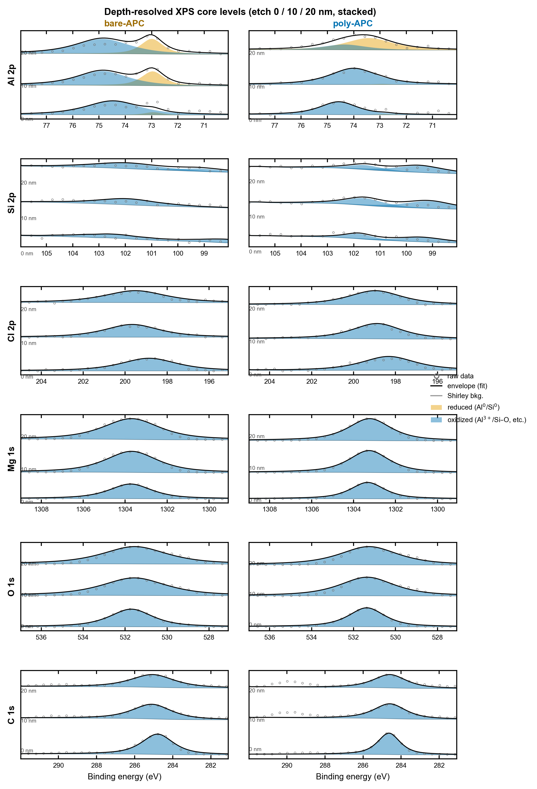

# Supporting Information

*A Silicon-Rich, Aluminum-Poor Interphase Templated by an In Situ Silsesquioxane Network Enables Reversible Magnesium Metal Anodes*

Author One,1 Author Two,1 and Corresponding Author1,*

## Experimental Section

### Materials and Electrolyte Preparation

The all-phenyl complex (APC) electrolyte was prepared by reacting AlCl3 with PhMgCl in tetrahydrofuran (THF) following established procedures.[8,14] poly-APC was obtained by adding the octa-functional polyhedral oligomeric silsesquioxane (POSS) monomer to APC and curing it in situ to form a self-standing gel.[18] All preparation and handling were carried out under an inert atmosphere. [Exact compositions, monomer identity, curing agent, and curing conditions to be supplied by the authors.]

### Cell Assembly

Mg||Mo6S8 full cells, Mg||Mg symmetric cells, and Mg||Cu cells were assembled in coin cells with magnesium foil electrodes and glass-fiber (GF/D) separators. Chevrel-phase Mo6S8 cathodes were prepared as described previously.[1,29] [Electrode loadings, areal capacities, and cell formats to be supplied.]

### Electrochemical Measurements

Mg||Mo6S8 cells were cycled galvanostatically at 0.5C and 1C; capacity retention is reported relative to the stabilized reversible capacity at cycle 5, with cycles 1–4 treated as formation. Symmetric Mg||Mg cells were cycled at 0.5 mA cm-2 and 0.5 mAh cm-2. Multi-rate cyclic voltammetry, potentiodynamic (Tafel) polarization, and critical-current-density tests were performed as described in the main text. Average Coulombic efficiency on Cu was evaluated with the Aurbach reservoir (macrocycling) protocol.[31] Mg2+ transference numbers were determined by the Bruce–Vincent steady-state method, combining potentiostatic polarization with impedance before and after polarization.[30] In situ electrochemical impedance spectra were acquired after each plating step and analyzed by the distribution of relaxation times.[36]

### Materials Characterization

Time-of-flight secondary-ion mass spectrometry (ToF-SIMS) was performed in negative-ion mode with Cs+ sputter depth profiling; intensities were corrected for the borosilicate-separator baseline, and only the poly-APC excess above that baseline was assigned to the POSS layer. X-ray photoelectron spectroscopy (XPS) used Al Kα radiation with Ar+ sputter depth profiling (0/10/20 nm); spectra were charge-referenced to adventitious C 1s at 284.8 eV, background-subtracted with a Shirley function,[37] and fitted with Gaussian–Lorentzian GL(30) line shapes. Raman spectroscopy, X-ray diffraction (for Mg texture), and scanning electron microscopy with energy-dispersive X-ray spectroscopy (SEM/EDS) were performed on cycled electrodes. The EDS silicon signal localizes on the glass-fiber separator and is an artifact, so the silicon-enrichment result rests on ToF-SIMS.

## Computational Methods

### Molecular DFT

Molecular calculations used the B3LYP functional[23,24] with the D3(BJ) dispersion correction[25] and def2-TZVP//def2-SVP basis sets,[26] together with the SMD continuum solvation model for THF.[27] APC anion and cation structures were optimized and frequency-verified, and relative free energies at 298 K defined the Schlenk speciation. Vertical and adiabatic ionization potentials and electron affinities were converted to potentials versus Mg2+/Mg, and stepwise reductive-decomposition pathways were mapped. Electron affinities were cross-checked with the ωB97X-D[38] and M06-2X[39] functionals, and wavefunction and electrostatic-potential analysis used Multiwfn.[40]

### Periodic DFT and Ab Initio Molecular Dynamics

Periodic calculations used CP2K[32] with the PBE functional[41] and D3 dispersion,[25] GTH pseudopotentials,[42] and MOLOPT basis sets.[43] A Mg(0001) slab, with its work function validated against experiment, was used to compute Al adatom adsorption, Al substitution and Mg–Al alloying energetics, candidate-SEI formation energies, densities of states and Mg|SEI band alignment, and Mg2+ migration barriers by the climbing-image nudged elastic band method.[44] Interface ab initio molecular dynamics containing the real cation and aluminate anion were run under constant-potential conditions; the band gaps quoted in the main text are k-point values. Periodic structures were rendered with VESTA.[45]

### Classical Molecular Dynamics

Classical MD used GROMACS[46] with an OPLS all-atom force field,[47] particle-mesh Ewald electrostatics,[48] and a Nosé–Hoover thermostat,[49,50] over 3×100 ns trajectories at 298 K for bare-APC and the cured gel. Radial distribution functions, first-shell coordination numbers, SSIP/CIP/AGG speciation, cation–anion–solvent–network interaction-energy decomposition, self-diffusion coefficients, and Mg2+ transference numbers were extracted from the equilibrated trajectories.

### Machine-Learning Force Field

For reactive, large-cell, long-time interface simulation, a foundation machine-learning force field (MACE-MP-0,[51] with CHGNet[52] as a cross-check) was fine-tuned on DFT and AIMD reference labels for the {Mg, Al, Cl, O, C, H, Si} system, using an active-learning loop that returned high-uncertainty configurations to DFT. The model was validated against held-out DFT (energy and force mean absolute errors reported in the main text) before production runs of the Mg(0001)|electrolyte interface.

## Supplementary Figures and Tables

Figure S1 (below) shows the depth-resolved multi-element XPS used in the main-text Figure 3. Additional supplementary items, to be assembled from the analysis outputs, include: Tafel polarization curves and fits; in situ DRT spectra and trends; Aurbach and Mg||Cu Coulombic-efficiency data; Bruce–Vincent transference data and Nyquist fits; the classical-MD transport table (self-diffusion coefficients and transference numbers); DFT speciation and redox-ladder tables; candidate-SEI formation energies and band gaps; and MLFF validation (force/energy mean absolute errors and learning curve).

*Figure S1. Depth-resolved XPS core levels (Al 2p, Si 2p, Cl 2p, Mg 1s, O 1s, C 1s) for bare-APC and poly-APC at etch depths of 0, 10, and 20 nm. Open circles: raw data; grey line: Shirley background; shaded peaks: fitted Gaussian–Lorentzian components; black line: envelope.*

### Mg Full-Cell Performance Benchmark (Literature)

Table S1 compiles the reported non-aqueous magnesium-metal full cells used for the cycle-life versus Coulombic-efficiency benchmark in Figure 2e. Values are reproduced as stated in the cited sources. The confidence column records how directly each number could be verified (high: confirmed from the abstract or publisher text; med: consistent across secondary sources with the primary PDF inaccessible; low: single secondary source or a 2026 report); low-confidence and 2026 entries are listed for completeness but were not independently confirmed here and should be checked against the primary source before publication. This work is included for reference.

| System | Cathode | Electrolyte | Cycles | CE % | Ret. % | Rate (C) | Year | DOI | Conf. |
|---|---|---|---|---|---|---|---|---|---|
| this work 1C | Mo6S8 | poly-APC gel | 1592 | 99.9 | 80 | 1.0 | 2026 |  |  |
| this work 0.5C | Mo6S8 | poly-APC gel | 842 | 99.9 | 80 | 0.5 | 2026 |  |  |
| Aurbach 2000 | Mo6S8 | DCC (Grignard) | 2000 | 99.5 | 85 | 0.05 | 2000 | 10.1038/35037553 | high |
| Mohtadi 2012 | Mo6S8 | Mg(BH4)2-LiBH4 | 40 | 94 | NA | 1.0 | 2012 | 10.1002/anie.201204913 | med |
| Kim 2011 | Mo6S8 | HMDS-AlCl3 | 300 | 98.5 | NA | 0.2 | 2011 | 10.1038/ncomms1435 | med |
| Pan 2016 | 1,4-PAQ (organic) | Mg(HMDS)2-4MgCl2 | 1000 | 99.2 | 90.4 | 1.0 | 2016 | 10.1002/aenm.201600140 | high |
| Yoo 2017 | exp-TiS2 | MgCl2-AlCl3 (MMC) | 400 | 99.0 | 80 | 1.0 | 2017 | 10.1038/s41467-017-00431-9 | high |
| Nguyen 2020 | Mo6S8 | Mg(OTf)2-MgCl2 | 100 | 99.4 | 90.8 | 0.1 | 2020 | 10.1016/j.xcrp.2020.100265 | high |
| PTB gel 2023 | Mo6S8 | PTB gel-polymer (APC-derived) | 250 | 95.0 | NA | 0.5 | 2023 | 10.1126/sciadv.adh1181 | med |
| MLCC 2023 | Mo6S8 | MgCl2-LiCl all-inorganic | 10000 | 99.0 | NA | 50 | 2023 | 10.1002/eem2.12327 | med |
| Yang 2026 | Mo6S8 | TFSI + SiBr4/TMSP | 500 | 99.5 | 96 | 0.5 | 2026 | 10.1039/D6SC00095A | low |
| Ren 2023 | PAQS (organic) | APC | 1000 | NA | 99 | 5.0 | 2023 | 10.1016/j.cej.2022.139570 | high |
| Chen 2024 | MVOH/rGO | APC + Mg(TFSI)2 | 850 | NA | 84 | 0.1 | 2024 | 10.1007/s40820-024-01410-8 | high |
| Qu 2025 | CuSe | Mg(TFSI)2-MgCl2 | 400 | NA | 91 | 0.4 | 2025 | 10.1038/s41467-025-56556-9 | high |
| Abouzari 2021 | Cu-porphyrin | APC | 500 | NA | NA | 1.0 | 2021 | 10.1002/cssc.202100340 | high |
| Liang 2011 | MoS2 | Mg(AlCl3Bu)2 | 50 | NA | 95 | 0.1 | 2011 | 10.1002/adma.201003560 | high |

*Table S1. Reported non-aqueous Mg-metal full cells (electrolyte, cathode, cycle life, Coulombic efficiency, capacity retention, rate) underlying the Figure 2e Pareto benchmark.*

## Supplementary References

[36] T. H. Wan, M. Saccoccio, C. Chen, F. Ciucci, “Influence of the Discretization Methods on the Distribution of Relaxation Times Deconvolution: Implementing Radial Basis Functions with DRTtools,” Electrochim. Acta 2015, 184, 483–499.

[37] D. A. Shirley, “High-Resolution X-Ray Photoemission Spectrum of the Valence Bands of Gold,” Phys. Rev. B 1972, 5, 4709–4714.

[38] J.-D. Chai, M. Head-Gordon, “Long-range corrected hybrid density functionals with damped atom–atom dispersion corrections,” Phys. Chem. Chem. Phys. 2008, 10, 6615–6620.

[39] Y. Zhao, D. G. Truhlar, “The M06 suite of density functionals for main-group thermochemistry, kinetics, noncovalent interactions, excited states, and transition elements,” Theor. Chem. Acc. 2008, 120, 215–241.

[40] T. Lu, F. Chen, “Multiwfn: A multifunctional wavefunction analyzer,” J. Comput. Chem. 2012, 33, 580–592.

[41] J. P. Perdew, K. Burke, M. Ernzerhof, “Generalized Gradient Approximation Made Simple,” Phys. Rev. Lett. 1996, 77, 3865–3868.

[42] S. Goedecker, M. Teter, J. Hutter, “Separable dual-space Gaussian pseudopotentials,” Phys. Rev. B 1996, 54, 1703–1710.

[43] J. VandeVondele, J. Hutter, “Gaussian basis sets for accurate calculations on molecular systems in gas and condensed phases,” J. Chem. Phys. 2007, 127, 114105.

[44] G. Henkelman, B. P. Uberuaga, H. Jónsson, “A climbing image nudged elastic band method for finding saddle points and minimum energy paths,” J. Chem. Phys. 2000, 113, 9901–9904.

[45] K. Momma, F. Izumi, “VESTA 3 for three-dimensional visualization of crystal, volumetric and morphology data,” J. Appl. Crystallogr. 2011, 44, 1272–1276.

[46] M. J. Abraham, T. Murtola, R. Schulz, S. Páll, J. C. Smith, B. Hess, E. Lindahl, “GROMACS: High performance molecular simulations through multi-level parallelism from laptops to supercomputers,” SoftwareX 2015, 1–2, 19–25.

[47] W. L. Jorgensen, D. S. Maxwell, J. Tirado-Rives, “Development and Testing of the OPLS All-Atom Force Field on Conformational Energetics and Properties of Organic Liquids,” J. Am. Chem. Soc. 1996, 118, 11225–11236.

[48] U. Essmann, L. Perera, M. L. Berkowitz, T. Darden, H. Lee, L. G. Pedersen, “A smooth particle mesh Ewald method,” J. Chem. Phys. 1995, 103, 8577–8593.

[49] S. Nosé, “A unified formulation of the constant temperature molecular dynamics methods,” J. Chem. Phys. 1984, 81, 511–519.

[50] W. G. Hoover, “Canonical dynamics: Equilibrium phase-space distributions,” Phys. Rev. A 1985, 31, 1695–1697.

[51] I. Batatia, et al., “A foundation model for atomistic materials chemistry,” arXiv:2401.00096, 2024.

[52] B. Deng, P. Zhong, K. Jun, J. Riebesell, K. Han, C. J. Bartel, G. Ceder, “CHGNet as a pretrained universal neural network potential for charge-informed atomistic modelling,” Nat. Mach. Intell. 2023, 5, 1031–1041.
